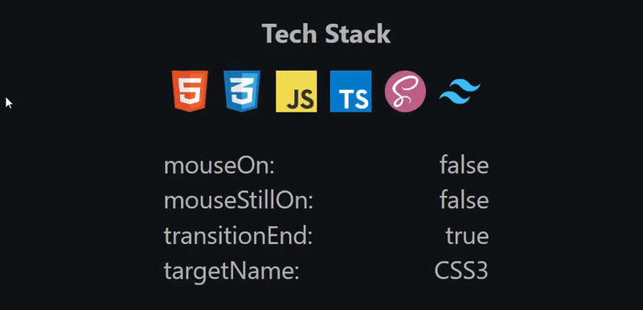

# Tech Stack Animation - Development

This repository contains an interactive animation created using HTML, CSS, and JavaScript. The animation demonstrates a tech stack concept where hovering over different technology icons triggers dynamic text effect. Additionally, the branch includes a table for debugging animations.

---

<p align="center" style="border: 4px solid white;">
   
</p>

## Features

- **Interactive Animation**: Users can hover over technology icons to trigger animation and display relevant information.
- **Dynamic Transitions**: Smooth transitions enhance the user experience when interacting with the animation.

## How to Use

1. **Clone the Repository**: Clone this repository to your local machine using the following command:

   ```bash
   git clone --single-branch --branch dev https://github.com/pawel-swiader/tech-stack-animation.git
   ```

2. **Open `index.html`**: Navigate to the project directory and open `index.html` in your preferred web browser.

3. **Interact with the Animation**: Hover over the technology icons to observe the animation effects. The debugging table provides real-time information about the animation's state.

## Files Structure

- **`index.html`**: Contains the structure of the web page and integrates the JavaScript and CSS files.
- **`styles.css`**: Defines the styles for the animation and debugging table.
- **`index.js`**: Implements the JavaScript functionality for the interactive animation.

## Customization

Feel free to customize the animation by modifying the HTML, CSS, and JavaScript files according to your preferences. You can add more technology icons, adjust transition timings, or enhance the visual effects.

## Feedback and Contributions

Feedback and contributions are welcome! If you have any suggestions for improvements or would like to contribute new features, please open an issue or submit a pull request.

## License

This project is licensed under the MIT License - see the [LICENSE](LICENSE) file for details.

---

By [Paweł Świąder](https://github.com/pawel-swiader)
